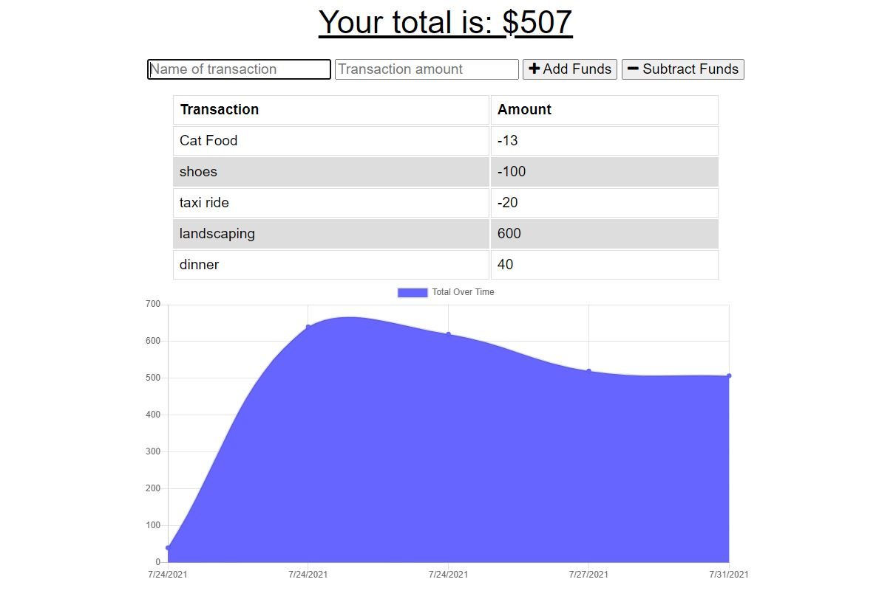

# Budget Tracker

## Description

Updating an existing budget tracker application to allow for offline access and functionality. The user will be able to add expenses and deposits to their budget with or without an internet connection. If the user enters transactions offline, the total should be updated when they're brought back online.

## Built With

- IndexDB
- NoSQL
- PWA
- Service Workers
- compression
- express
- mongoose
- morgan

## Usage

## Repository

- [GitHub] https://github.com/natasharrison/budget-tracker.git
- [Heroku] https://hidden-inlet-21667.herokuapp.com/

## Screenshot 

## Contributing

- Starter code provided by UA Coding Bootcamp
- Lesson 18.4 NoSQL for PWA offline functionality
- Lesson 19.4 Using Service Worker